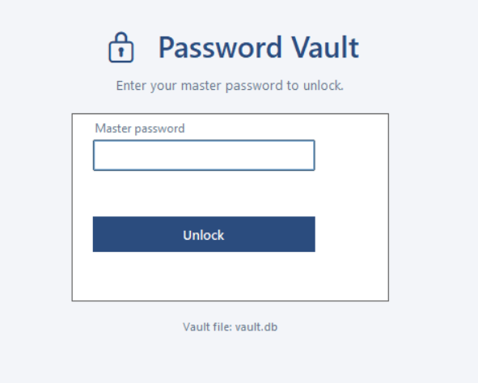
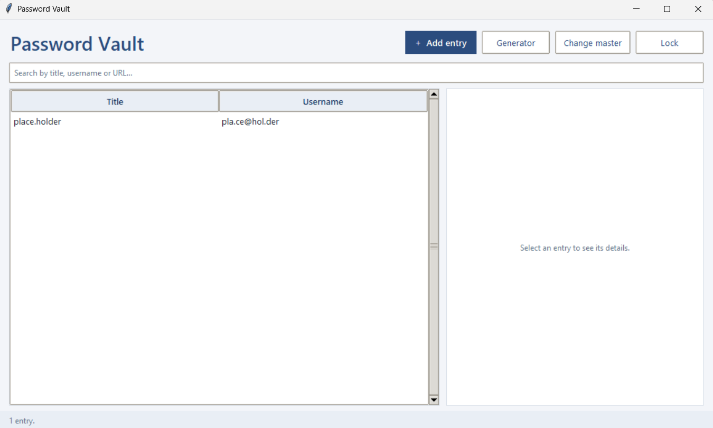
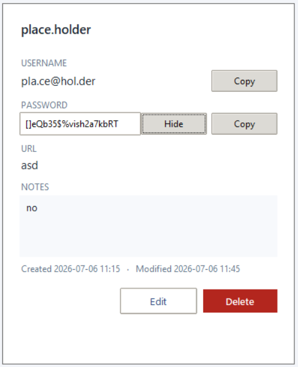
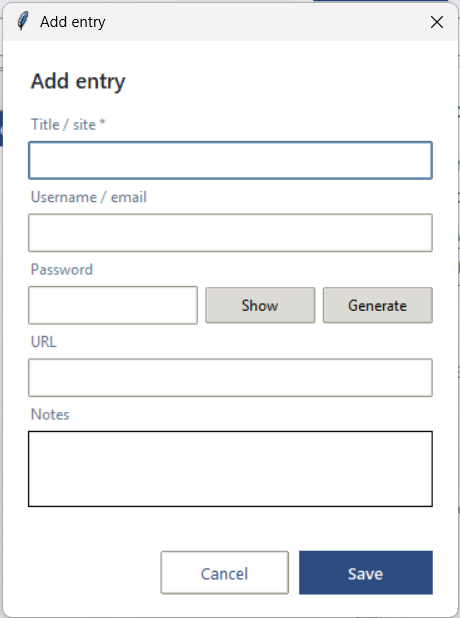
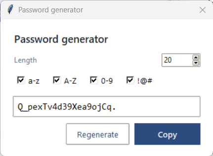
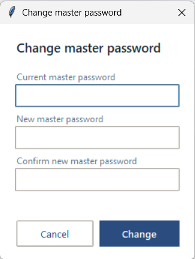

# 🔒 Password Vault

A local password manager that stores your credentials **encrypted** and unlocks
them with a single **master password**. Built for a Digital Security course
project, with a working command-line app **and** a polished graphical interface.

> Every secret is encrypted with **AES-256-GCM**; the master password is
> stretched into the encryption key with the memory-hard **Scrypt** KDF; and
> everything is kept in an **encrypted SQLite** file that contains nothing but
> ciphertext.

---

## ✨ Features

- **One master password** unlocks the whole vault — it is never stored anywhere.
- **AES-256-GCM** authenticated encryption (confidentiality **+** tamper detection).
- **Scrypt** memory-hard key derivation with a per-vault random salt.
- **Encrypted SQLite** storage — the database file reveals only the number of entries.
- **View, copy and reveal** stored passwords (Show/Hide toggle, clipboard auto-clear).
- **Strong password generator** (configurable length and character classes).
- **Change master password** with full re-encryption of the vault.
- **Auto-lock** after inactivity + manual lock.
- Both a **CLI** (`pwmanager.py`) and a **GUI** (`pwmanager_gui.py`) on the same backend.

---

## 🖼️ Screenshots

> The images below are placeholders — replace the files in `screenshots/` with
> your own captures (keep the same filenames).

### Unlock / create screen


### Main window — entry list and details


### Viewing a stored password


### Add / edit entry


### Password generator


### Change master password


---

## 🚀 Getting started

**Requirements:** Python 3.10+ and the `cryptography` package. The GUI additionally
uses `tkinter`, which ships with standard Python / Anaconda (on bare Linux:
`sudo apt install python3-tk`).

```bash
pip install -r requirements.txt
```

### Run the GUI

```bash
python3 pwmanager_gui.py            # uses ./vault.db
python3 pwmanager_gui.py mine.db    # custom vault file
```

### Run the CLI

```bash
python3 pwmanager.py                # menu-driven terminal interface
```

On first launch you set the master password; on later launches you enter it to
unlock. If you forget the master password, the data is **unrecoverable by
design** — that is the whole point of the encryption.

---

## 🔐 How it works (short version)

1. **Key derivation.** `master password + random salt → Scrypt → 32-byte AES key`.
   Scrypt is memory-hard (~32 MB/attempt), so brute-forcing the master password
   is very expensive. The salt is stored in the clear (it is not secret).
2. **Encryption.** Every entry is serialised to JSON and encrypted with
   AES-256-GCM using a **fresh random nonce**. GCM's authentication tag detects
   any tampering.
3. **Master check.** A known constant is encrypted at setup (the *verifier*).
   On unlock, if it decrypts correctly the password is right — without ever
   storing the password or key.
4. **Storage.** Only ciphertext and non-secret KDF parameters are written to
   SQLite, so a stolen `.db` file is opaque.

Full reasoning, threat model and limitations are in
[`DOCUMENTATION.md`](DOCUMENTATION.md) and the LaTeX report (`documentation.tex`).

---

## 🧪 Testing

```bash
python3 selftest.py
```

Runs 12 automated checks covering round-trip correctness, sorting, search,
update/delete, locking, wrong-password rejection, **no plaintext leakage in the
DB file**, **tamper detection**, and master-password re-keying.

---

## 📁 Project structure

```
pwvault/
├── pwmanager_gui.py     # graphical interface (Tkinter) — run this for the GUI
├── pwmanager.py         # command-line interface
├── vault.py             # encrypted SQLite storage, CRUD, re-keying
├── crypto_utils.py      # Scrypt KDF, AES-256-GCM, password generator
├── selftest.py          # automated functional + security tests
├── requirements.txt     # single dependency: cryptography
├── DOCUMENTATION.md      # project documentation (Markdown)
├── documentation.tex    # project documentation (LaTeX report)
└── screenshots/         # images used by the README and the report
```

---

## ⚠️ Security notes & limitations

- A weak master password undermines everything — choose a long passphrase.
- While unlocked, secrets live in memory; a compromised machine (keylogger,
  memory scraper) can still capture them.
- Metadata (the *number* of entries) is visible in the file.
- For transparent full-file encryption including metadata, **SQLCipher** is a
  natural upgrade (discussed in the report).

---

## 📜 License

Educational project — free to use and adapt for learning purposes.
